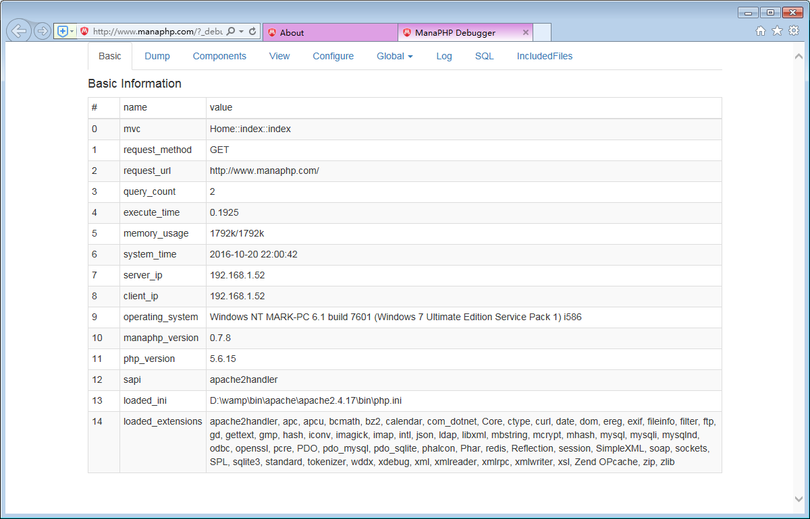
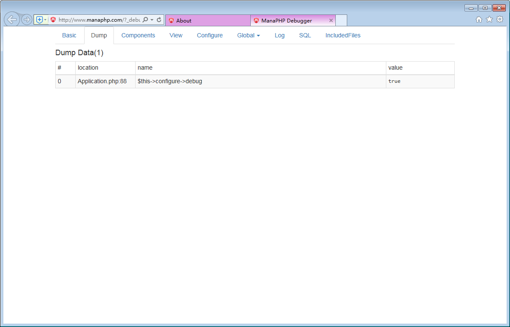
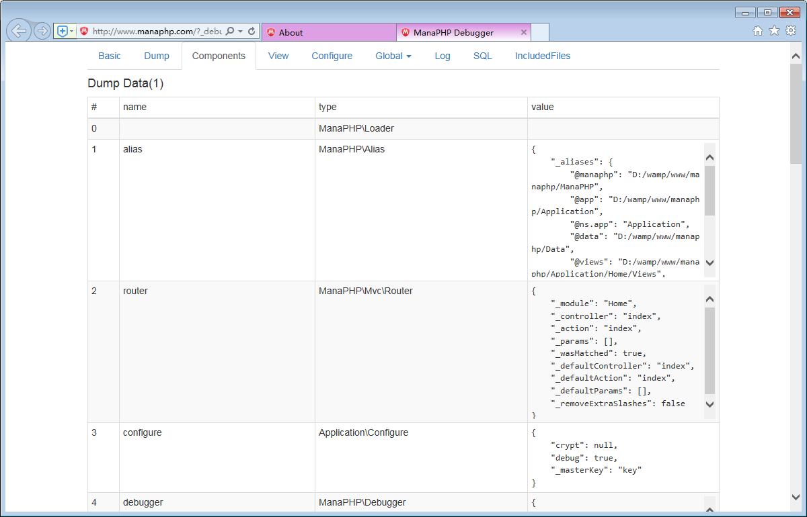
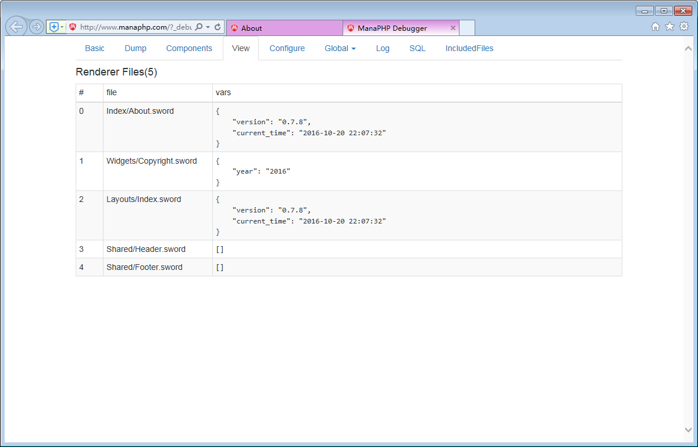
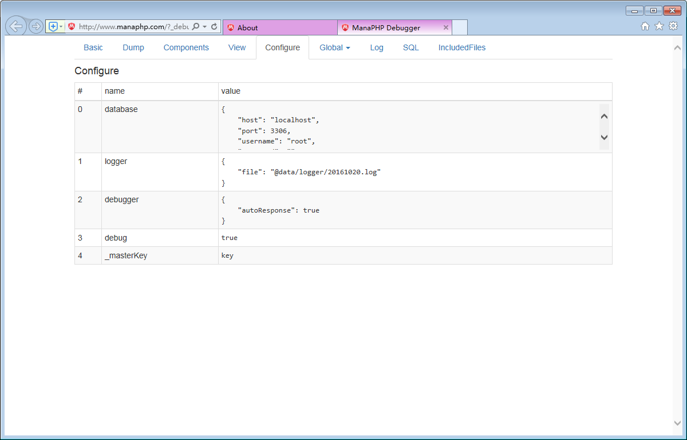
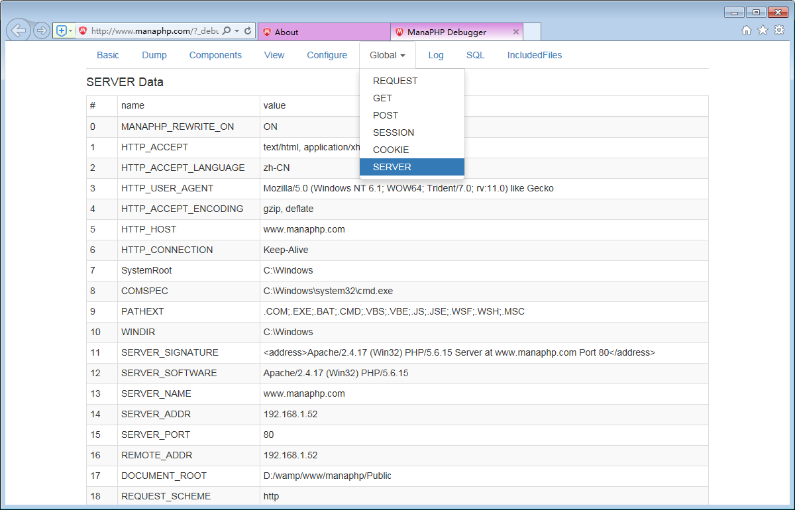
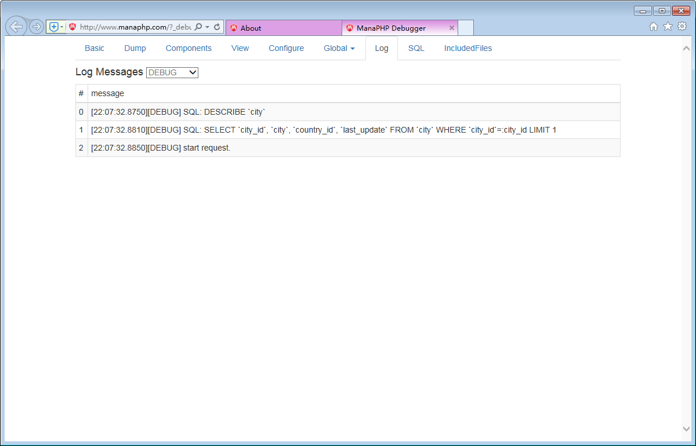
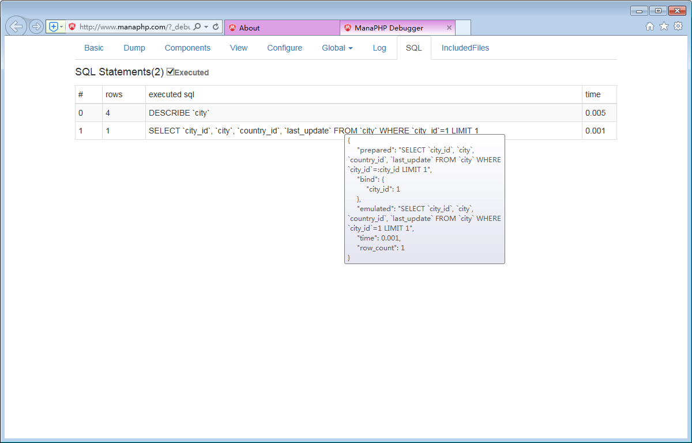

# 使用调试器
ManaPHP 为了方便开发人员查找程序中出现的错误，提供了一个调试器组件。

请用下面的命令开始启用调试器组件:

```php
    <?php
    $debug = new \ManaPHP\Debugger();
    $debug->start();
```

# 基本信息


# Dump


#组件内部状态


#视图数据


#配置相关信息


#全局数据


#LOG


#SQL


#包含的文件

